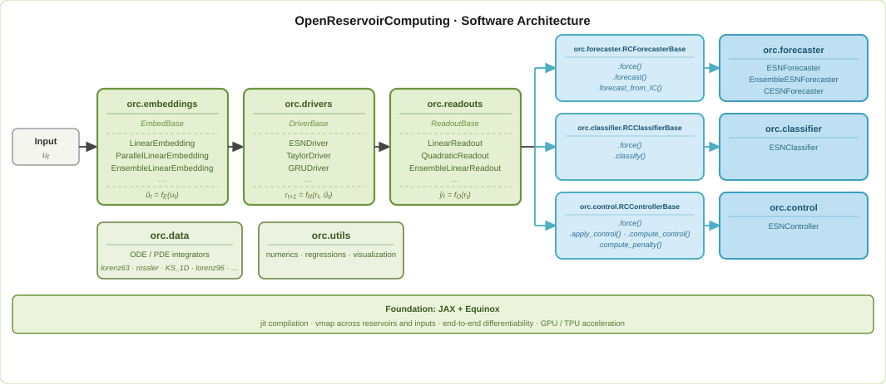

# Summary

OpenReservoirComputing (ORC) is a Python library for reservoir computing (RC) built on JAX and Equinox. RC is a form of machine learning that functions by lifting a low-dimensional sequence or signal into a high-dimensional dynamical system and training a simple, linear readout layer from the high-dimensional dynamics back to a lower-dimensional quantity of interest. The most common application of RC is time-series forecasting, where the goal is to predict a signal's future evolution. RC has achieved state-of-the-art performance on this task, particularly when applied to chaotic dynamical systems. In addition, RC approaches can be adapted to perform classification and control tasks. ORC provides both modular components for building custom RC models and built-in models for forecasting, classification, and control. By building on JAX and Equinox, ORC offers GPU acceleration, JIT compilation, and automatic vectorization. These capabilities make prototyping new models faster and enable larger and more powerful reservoir architectures. End-to-end differentiability also enables seamless integration with other deep learning models built with Equinox.

# Statement of Need

Time-series prediction, classification, and control are fundamental tasks across science and engineering, arising in applications from climate modeling and fluid dynamics to robotics and neuroscience. Deep learning approaches to these tasks typically require large datasets, long training times, and careful tuning of optimization hyperparameters. RC offers a compelling alternative. Since only the readout layer is trained via a single ridge regression, RC models can be trained in a fraction of the time required by comparable recurrent neural networks, often with less data and fewer hyperparameters to tune [@lukosevicius2009reservoir]. This makes RC particularly attractive for rapid prototyping, real-time applications, and settings where training data is limited. However, realizing these benefits in practice requires software that is both efficient and adaptable.

ORC's built-in models provide an easy entry point for users new to the field. In particular, a new user can supply their own time-series data to instantiate, train, and forecast in three simple lines of code. Built-in visualization tools make it easy to evaluate model performance. Varying the hyperparameters of built-in models lets users explore how RC performance depends on configuration choices. While other RC libraries allow for easy use with low-dimensional systems, ORC's JAX foundation makes extending to higher-dimensional systems via parallel reservoirs equally simple (also achievable in three lines of code). For spatiotemporal forecasting problems, JAX's `vmap` transformation enables efficient vectorization across parallel reservoirs that decompose a spatial domain into overlapping subdomains, while JIT compilation eliminates Python overhead in the reservoir state evolution loop. Since RC approaches are so fast to train, this provides an easy way for users to train lightweight surrogate models.

Much RC research is aimed at designing performant reservoir architectures. ORC makes this easy through its use of abstract base classes for Embedding, Driver, and Readout layers. Users need only define forward pass logic to integrate a new reservoir topology or readout strategy, while reusing the rest of the framework. This also allows for easy ablation studies comparing how different components affect RC performance. It also makes it straightforward to reuse existing architectures, without the additional complexity of writing teacher forcing or autoregressive prediction functions from scratch.

Because of ORC's functional approach in JAX, built-in and user-created models provide end-to-end differentiability by default. This enables gradient-based optimization of input sequences for control problems. This also makes ORC well suited to integrate with deep learning models such as those presented in [@ozalp2023reconstruction; @ozalp2025real]. ORC models are simply Equinox modules, allowing them to be composed with other Equinox models.

# State of the Field
| | Language | GPU | DL Compatible | Parallelizable | Forecasting | Classification | Control | Continuous Time |
|---|---|---|---|---|---|---|---|---|
| **OpenReservoirComputing** | Python | ✓ | ✓ | ✓ | ✓ | ✓ | ✓ | ✓ |
| **ReservoirPy** | Python | ✓* | ✗ | ✗ | ✓ | ✓ | ✗ | ✗ |
| **ReservoirComputing.jl** | Julia | ✓ | ✓ | ✓ | ✓ | ✓ | ✗ | ✗ |

Table 1: Comparison of reservoir computing libraries across key features. ✓ indicates full support; ✗ indicates no support. \*ReservoirPy's GPU support is available via its JAX backend (v0.4.0+) but does not fully exploit JAX's functional programming model. {#tbl:comparison}

The most commonly used open-source library for reservoir computing is ReservoirPy [@trouvain2020reservoirpy]. Much like ORC, ReservoirPy provides a variety of built-in architectures, as well as an easy-to-use API for designing one's own layers. ReservoirPy was initially built on NumPy and SciPy with the maintainers adding a JAX backend in v0.4.0. However, ORC differs from ReservoirPy in several important ways.

First, ORC was *designed* on top of JAX [@jax2018github] and Equinox [@kidger2021equinox], which provide a different programming model based on functional transformations. This enables native GPU/TPU acceleration, JIT compilation, and composable transformations (`jit`, `vmap`, `grad`) that cannot be retrofitted into a NumPy-based architecture. While the JAX backend of ReservoirPy does improve performance, the API cannot fully exploit JAX's capabilities. For example, ORC's autoregressive forecast loop uses `jax.lax.scan`, avoiding Python overhead; ReservoirPy's object-oriented design makes this impossible.

Second, ORC has a different built-in feature set. ORC supports continuous-time reservoir dynamics via Diffrax [@kidger2021on], allowing users to define reservoir equations as ordinary differential equations solved with adaptive-step integrators. ORC also supports novel architectures such as Taylor-expanded and GRU-based drivers alongside standard echo state networks. ReservoirPy does not provide these functionalities. 

Third, ORC models work seamlessly with other deep learning models implemented in Equinox. ReservoirPy is an outstanding library for standalone RC tasks that do not need to integrate with other deep learning frameworks. Working with NumPy rather than JAX may also be more accessible for users unfamiliar with functional programming. However,  ORC's design priorities and advantages are nonetheless distinct from ReservoirPy's, as outlined above.

Other open source libraries for RC include Pytorch-ESN [@nardo2018pytorchesn] and ReservoirComputing.jl [@martinuzzi2022reservoircomputing]. Pytorch-ESN allows for integration with other PyTorch models, but is not as widely adopted and offers a much more limited feature set than ORC or ReservoirPy. ReservoirComputing.jl is a widely used Julia library for RC that influenced many of ORC's design choices. In particular, ORC's modular design draws heavily from ReservoirComputing.jl. Since Python dominates much of machine learning research, bringing these capabilities to Python is valuable for the broader ML community. A summary of the functionality of ORC, ReservoirPy, and ReservoirComputing.jl is presented in Table 1. 

# Software Design

ORC models are decomposed into three components, illustrated in \autoref{fig:architecture}: (i) an embedding that lifts a low-dimensional input signal $u_t$ to a high-dimensional space, (ii) a driver that propagates the high-dimensional state $r_t$, and (iii) a readout that maps the latent state back to an approximation of some low-dimensional signal $y_t$. Depending on the task at hand, $y_t$ may be a future time-step of $u_t$, a label associated with input data, or some other target signal. ORC differs from many existing approaches that unify (i) and (ii). Separating the embedding from the reservoir state propagation allows for cleaner application of RC to non-standard tasks, such as acting as a surrogate model for model predictive control. It also allows for the easier incorporation of non-standard embeddings, including stochastic embeddings that can arise in the study of physical RC systems. Moreover, the modular design lets components developed for one task (e.g., forecasting) be reused directly in another (e.g., classification).

All components are implemented as Equinox modules [@kidger2021equinox], which are immutable pytree-registered objects. Model parameters (reservoir weights, readout matrices) are stored as JAX arrays within the module, and parameter updates produce new module instances via `eqx.tree_at` rather than mutating state in place. This functional design enables JAX's composable transformations to operate directly on model objects and allows ORC models to be composed with other Equinox modules.

ORC supports parallel reservoirs by default via a `chunks` parameter in each module. This slightly complicates built-in training support and introduces an extra tensor dimension that can make the API less intuitive at first. However, we believe this tradeoff is worthwhile because it enables spatiotemporal RC methods unavailable in other libraries.

ORC provides unified training functions (`train_RCForecaster`, `train_RCClassifier`, `train_RCController`) that work with any model inheriting from the corresponding base class, including user-defined models with custom components. These functions delegate shape handling to the readout layer and accept keyword arguments that are forwarded to the model's `force` method, allowing the same training function to handle both discrete and continuous-time models transparently.

The library provides three built-in model classes: `ESNForecaster` for time series prediction, `ESNClassifier` for sequence classification, and `ESNController` for learning control policies with exogenous control inputs. Each composes embedding, driver, and readout components and provides task-specific methods (`forecast`, `classify`, `apply_control`). Users who need custom architectures can subclass the abstract base classes, define only the components that differ, and immediately use the unified training functions without reimplementing teacher forcing, autoregressive prediction, or ridge regression.

ORC also includes a data generation module with ODE and PDE integrators for standard benchmark systems, including the Lorenz-63 attractor, Rössler system, double pendulum, Lorenz-96 model, and the Kuramoto-Sivashinsky equation, all implemented using Diffrax.

# Research Impact Statement

ORC addresses an immediate need for RC researchers. It allows for easy reimplementation of architectures such as [@ozalp2023reconstruction; @ozalp2025real] that integrate reservoir computing with larger neural network architectures, and makes it easier to iterate on these ideas than any existing library. We also benchmark ORC against ReservoirPy across reservoir sizes in \autoref{fig:comp}. We find that particularly with GPU acceleration, ORC scales far better than ReservoirPy. Moreover, ORC is the only current package that supports training RC for control tasks, thanks to its efficiency and the end-to-end differentiability that JAX and Equinox provide. RC-based control has recently been shown to be advantageous over other popular forms of RNN-based MPC [@williams2024reservoir]. ORC's performance also makes it well suited for the parallel architectures needed to extend RC to higher-dimensional settings.

# AI Usage Disclosure

Claude (Anthropic) was used for code assistance during code debugging, proofreading this paper, and the generation of the ORC logo and architecture visualization SVG. All generated code was reviewed, tested, and validated by the authors.

# Acknowledgements
The authors acknowledge support from the National Science Foundation AI Institute in Dynamic Systems (grant number 2112085). The authors also thank Anastasia Bizyaeva, Noa Kaplan, Ling-Wei Kong for insightful conversations.
