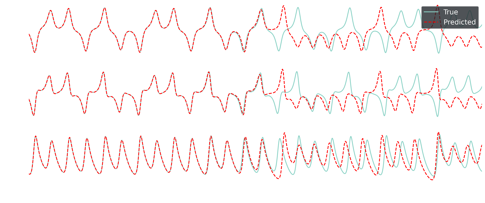

<div align="center">
  
</div>

# ORC: Open Reservoir Computing

[](https://github.com/dtretiak/OpenReservoirComputing/actions/workflows/tests.yml)


ORC is the one-stop-shop for performant reservoir computing in jax. Key high-level features include
- Modular design for mixing and matching layers and reservoir drivers (or creating your own!)
- Continuous, discrete, serial, and parallel implementations
- Built in hyperparameter tuning (coming soon!)
- Multi-gpu training and inference (coming soon!)

## Installation
***

To install ORC, first clone the repository onto your local machine
```bash
git clone https://github.com/dtretiak/OpenReservoirComputing.git
```

Then navigate to the cloned directory and use `pip` to install:
```bash
pip install .
```

If you would like to use ORC on GPU(s), install the optional GPU dependencies:
```bash
pip install .[gpu]
```

To run the example notebooks, install the optional notebook dependencies:
```bash
pip install .[notebooks]
```

## Quick start example
***
Below is a minimal quick-start example to train your first RC with ORC. It leverages the 

```python
import orc

# integrate the Lorenz system 
U,t = orc.data.lorenz63(tN=100, dt=0.01)

# train-test split
test_perc = 0.2
split_idx = int((1 - test_perc) * U.shape[0])
U_train = U[:split_idx, :]
t_train = t[:split_idx]
U_test = U[split_idx:, :]
t_test = t[split_idx:]

# Initialize and train the ESN
esn = orc.models.ESNForecaster(data_dim=3, res_dim=400)
esn, R = orc.models.train_ESNForecaster(esn, U_train)

# Forecast! 
U_pred = esn.forecast(fcast_len=U_test.shape[0], res_state=R[-1]) # feed in the last reservoir state seen in training
```

To visualize the forecast and compare it to the test data use `orc.utils.visualization`:
```python 
orc.utils.visualization.plot_time_series(
    [U_test, U_pred],
    (t_test - t_test[0]), # start time at 0
    state_var_names=["$u_1$", "$u_2$", "$u_3$"],
    time_series_labels=["True", "Predicted"],
    line_formats=["-", "r--"],
    x_label= r"$\lambda_1 t$",
)
```

<div align="center">
  
</div>


## Contribution guidelines
***
