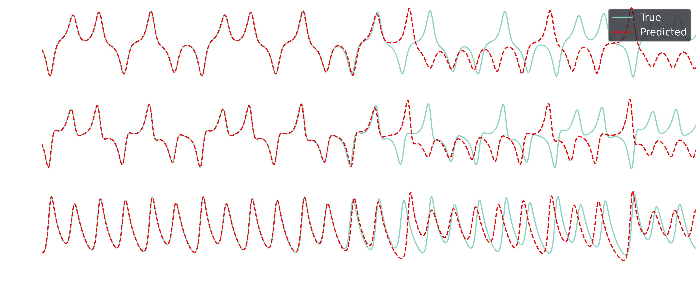

<div align="center">
  
</div>

# ORC: Open Reservoir Computing
[](https://github.com/Jan-Williams/OpenReservoirComputing/actions/workflows/tests.yml)
[](https://codecov.io/gh/Jan-Williams/OpenReservoirComputing)


ORC is the one-stop-shop for performant reservoir computing in jax. Key high-level features include
- Modular design for mixing and matching layers and reservoir drivers (or creating your own!)
- Continuous, discrete, serial, and parallel implementations

## Installation

The easiest way to get started with ORC is to install from PyPI:
```bash
pip install OpenReservoirComputing
```

or, if you use [uv](https://docs.astral.sh/uv/):
```bash
uv add OpenReservoirComputing
```

If you're interested in the latest, unreleased version or in contributing, you can install from source. Please see the Contribution guidelines below for more details. 

## Quick start example
Below is a minimal quick-start example to train your first RC with ORC. It leverages the built-in data library to integrate the Lorenz63 ODE before training and forecasting with ORC.

```python
import jax
# ORC models often perform much better with float64 enabled
jax.config.update("jax_enable_x64", True)
import orc

# integrate the Lorenz system 
U,t = orc.data.lorenz63(tN=100, dt=0.01)

# train-test split
test_perc = 0.2
split_idx = int((1 - test_perc) * U.shape[0])
U_train = U[:split_idx, :]
t_train = t[:split_idx]
U_test = U[split_idx:, :]
t_test = t[split_idx:]

# Initialize and train the ESN
esn = orc.forecaster.ESNForecaster(data_dim=3, res_dim=400)
esn, R = orc.forecaster.train_RCForecaster(esn, U_train)

# Forecast! 
U_pred = esn.forecast(fcast_len=U_test.shape[0], res_state=R[-1]) # feed in the last reservoir state seen in training
```

To visualize the forecast and compare it to the test data, we can use `orc.utils.visualization`:
```python 
orc.utils.visualization.plot_time_series(
    [U_test, U_pred],
    (t_test - t_test[0]), # start time at 0
    state_var_names=["$u_1$", "$u_2$", "$u_3$"],
    time_series_labels=["True", "Predicted"],
    line_formats=["-", "r--"],
    x_label= r"$t$",
)
plt.show()
```

<div align="center">
  
</div>

## jit, vmap, grad...

ORC models are built on top of [Equinox](https://docs.kidger.site/equinox/), and as a result we strongly recommend the use of Equinox transforms `eqx.filter_{jit, vmap, grad}` over `jax.{jit, vmap, grad}`. For more details, please check out the [JAX JIT Compatibility](https://Jan-Williams.github.io/OpenReservoirComputing/examples/jit_compatibility/) example notebook.

## Contribution guidelines
First off, thanks for helping out! We appreciate your willingness to contribute! ORC uses [uv](https://docs.astral.sh/uv/) to manage development environments, so getting set up takes two commands.

First, [install uv](https://docs.astral.sh/uv/getting-started/installation/) if you don't have it. Then clone the repo and sync:

```bash
git clone https://github.com/Jan-Williams/OpenReservoirComputing.git
cd OpenReservoirComputing
uv sync
```

`uv sync` creates a `.venv`, installs ORC in editable mode, and installs the development dependencies at the exact versions recorded in `uv.lock`. There is no need to activate the environment — just prefix commands with `uv run`.

For NVIDIA GPU support (Linux only — see the [installation docs](https://Jan-Williams.github.io/OpenReservoirComputing/getting-started/installation/) for why):
```bash
uv sync --extra gpu
```

To also install the documentation toolchain:
```bash
uv sync --all-groups
```

The main branch is protected from direct changes. If you would like to make a change please create a new branch and work on your new feature. After you are satisfied with your changes, please run our testing suite to ensure all is working well. We also expect new tests to be written for all changes if additions are made. The tests can be simply run from the root directory of the repository with
```bash
uv run pytest
```
Followed by a formatting check 
```bash
uv run ruff check
```
and a type annotation check
```bash
uv run ty check src/
```

If you add or change a dependency, use `uv add <package>` (or `uv add --group dev <package>` for a development tool) and **commit the updated `uv.lock`** — CI runs `uv sync --locked` and will fail if the lockfile is out of date.

Finally, submit your changes as a pull request! When you submit the PR, please request reviews from both @dtretiak and @Jan-Williams, we will try to get back to you as soon as possible. When you submit the PR, the above tests will automatically be run on your proposed changes through Github Actions, so it is best to get everything tested first before submitting!